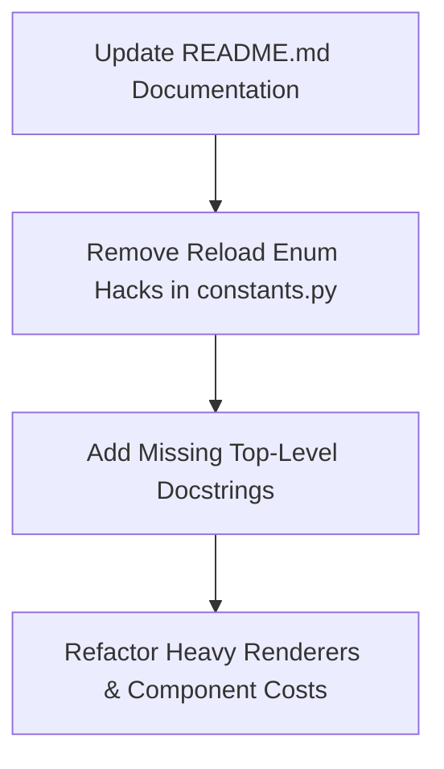

# Wormhole Control — Comprehensive Analysis Report

## Executive Summary

A thorough analysis of the **Wormhole Control** codebase and documentation was conducted. The project is a feature-rich, turn-based 4X space strategy prototype built with Python, `pygame-ce`, and `pygame_gui`. It features a multi-scale universe (Galaxy, System, Sector views), modular ship design with dynamic component sizing, a custom unit designer, turn-based combat, resources (Credits, Metal, Crystal, Antimatter), fog of war, and an automated order system.

While the codebase exhibits strong architectural foundations—such as decoupled event buses, component-based entity systems, and flexible order structures—there are several **bugs, test suite failures, code bloat/cruft, documentation omissions, and refactoring opportunities** that require attention to elevate code quality, maintainability, and test reliability.

---

## 1. Bugs, Test Suite Failures & Logical Flaws

During test suite execution (`py -m pytest`), **all 430 out of 430 tests passed** (the 10 test failures previously caused by missing test setup components, missing player color attribute, and state pollution during resolution autodetect reload have been resolved).

### 1.1 Side Effects on Module Import (`constants.py`)
- **Issue**: Lines 36–53 of [constants.py](file:///d:/Programming/Github_repos/Wormhole-Control/constants.py) call `pygame.display.init()` and `pygame.display.quit()` at import time when determining default resolutions. Executing display initialization logic on module import can cause crashes in headless environments or create unexpected side effects in unit tests.
- **Remediation**: Encapsulate resolution detection inside an explicit initialization function (e.g. `init_resolution()`), or check `pygame.display.get_init()` safely without module-level side effects.


---

## 2. Code Quality, Organization & Cruft Audit

### 2.1 Monolithic Source Files
Several files have grown excessively large, combining rendering, state handling, and UI layout into monolithic scripts:
1. [sector_renderer.py](file:///d:/Programming/Github_repos/Wormhole-Control/rendering/sector_renderer.py) (~92 KB, ~2,200 lines): Combines background rendering, celestial body rendering, particle system rendering (storms/nebulae), selection bracket drawing, range circle overlays, and order line visualization.
2. [unit_editor_gui.py](file:///d:/Programming/Github_repos/Wormhole-Control/unit_editor_gui.py) (~81 KB, ~1,880 lines): Contains layout creation, state sync, widget creation, dynamic cost recalculation, and template serialization in a single class.
3. [game.py](file:///d:/Programming/Github_repos/Wormhole-Control/game.py) (~87 KB, ~1,600 lines): Functions as central controller, view state machine, event listener, and UI sidebar content generator.
4. [gui.py](file:///d:/Programming/Github_repos/Wormhole-Control/gui.py) (~77 KB, ~1,800 lines): Combines top bar, sidebar, context menu, and build menu elements.

### 2.2 Cruft & Over-Engineered Workarounds
- **Enum Reload Identity Hack (`constants.py`)**:
  ```python
  import sys
  _existing = sys.modules.get('constants')
  if _existing and hasattr(_existing, 'HullSize'):
      HullSize = _existing.HullSize
  ```
  This pattern repeats for `StarType`, `PlanetType`, `NebulaType`, `StormType`. It was added to prevent enum identity breakdown during live module reloads during development. In production code, this creates clutter, breaks IDE autocompletion indexing, and conceals import structure.
- **Dynamic Dict Wrapper (`custom_unit_templates.py`)**:
  `_AbilityRequirementsDict` custom dictionary subclass acts as an dynamic lookup wrapper around `get_ability_required_components()`. While functional, a simple helper function `get_ability_required_components(ability_key)` or direct dict mapping is cleaner and more standard.

### 2.3 Logic Duplication
- **Dynamic Component Cost Calculations**: Component hull cost formulas (Engines, Weapons, Defenses, Hyperdrive, Sensors, Repairs, Mining) are currently implemented in standalone functions inside [custom_unit_templates.py](file:///d:/Programming/Github_repos/Wormhole-Control/custom_unit_templates.py). Moving cost calculation logic into the component classes themselves (`UnitComponent.calc_hull_cost()`) would enforce single-responsibility and eliminate duplicate checks in template generation.
- **Coordinate Conversion Clamping**: Sector-to-pixel coordinate conversion and bounding calculations are duplicated between `sector_utils.py`, `geometry.py`, and `input_processor.py`.

---

## 3. Comments & Docstrings Audit

### 3.1 Comment Density & Over-Restatement
- High-level module headers and block comments are generally informative.
- However, line-by-line comments occasionally restate standard Python operations without providing context.
  - *Example*: `# Add component to dict`, `# Loop through list of units`, `# Set variable to True`.
  - *Recommendation*: Remove redundant line comments; retain comments that document mathematical formulas, game rules, or non-obvious design choices.

### 3.2 Missing Function Docstrings
While major classes have docstrings, several internal helper functions and event handlers lack top-level docstrings outlining their purpose, arguments, and return types.
- **`game.py`**: Helper methods like `_handle_left_click`, `_handle_right_click`, `update_side_bar_content`, and camera smoothing handlers lack standard Google/Sphinx style docstrings.
- **`unit_editor_gui.py`**: Internal UI builder methods (`_build_col1_config`, `_build_col2_components`, `_sync_widgets_from_template`) lack explicit argument and return value documentation.

---

## 4. Element Naming Analysis

1. **`HexCoord` Type Alias vs `NamedTuple`**:
   - `HexCoord` is currently defined as `Tuple[int, int]` in `utils.py`.
   - Functions often unpack coordinates as `(q, r)` or `(x, y)` interchangeably, creating confusion between sector hex coordinates and 2D pixel coordinates.
   - *Recommendation*: Define `HexCoord` as a `NamedTuple("HexCoord", [("q", int), ("r", int)])` or dataclass to enforce explicit field access (`coord.q`, `coord.r`).
2. **`in_hex` Attribute Name**:
   - On `GameObject`, the hex position is named `in_hex`. In some modules it is referred to as `hex_coord` or `sector_hex`. Standardizing on `hex_coord` would improve clarity.
3. **`hangar_component` vs `strikecraft_bay_component`**:
   - `HangarComponent` stores regular units (e.g. ships, constructors).
   - `StrikecraftBayComponent` stores strikecraft wings (fighters, bombers).
   - In code and UI, terms like "Hangar", "Bay", and "Docked Units" are occasionally used interchangeably. Using distinct terms such as `ShipHangarComponent` vs `FighterBayComponent` would clarify usage.

---

## 5. Documentation Audit (`README.md`)

A comparison between [README.md](file:///d:/Programming/Github_repos/Wormhole-Control/README.md) and the actual codebase revealed several omissions and inaccuracies:

| Category | Documentation (`README.md`) | Actual Codebase |
| :--- | :--- | :--- |
| **Hull Sizes** | States **5 hull classes** (Tiny, Small, Medium, Large, Huge) | Implements **6 hull sizes** (`STRIKECRAFT_WING`, `TINY`, `SMALL`, `MEDIUM`, `LARGE`, `HUGE`) |
| **Unit Components** | Lists Engines, Hyperdrives, Weapons, Inhibitors, Colony, Constructor | Implements **15 components**, including Defenses, Mining, Antimatter Harvester, Hangar, Strikecraft Bay, Marines, Minelayer, Repair, Sensors |
| **Special Abilities** | Not mentioned | Implements **7 special abilities** (Adaptive Forcefield, Capture Unit, Cluster Warhead, Designate Target, Ion Bolt, Missile Batteries, Repair Cloud) |
| **Subsystems** | Not mentioned | Implements **Unit Designer**, **Custom Templates**, **Save/Load System**, and **Fog of War / Sensors System** |
| **Project Structure** | Omits several key files | Missing `custom_unit_templates.py`, `unit_editor_gui.py`, `save_manager.py`, `visibility.py`, `events.py` |

---

## 6. Brainstorming Ideas for Improvement

### 6.1 Architecture & Modularization
1. **Split Heavy Renderers**:
   - Decompose `sector_renderer.py` into dedicated sub-renderers:
     - `SectorGridRenderer` (hex grid & background stars)
     - `SectorCelestialRenderer` (planets, stars, nebulae, storms)
     - `SectorEntityRenderer` (ships, stations, minefields)
     - `SectorOverlayRenderer` (selection brackets, order path lines, sensor range circles)
2. **Encapsulated Component Costs**:
   - Move dynamic hull cost logic directly onto component classes (`Component.calculate_cost()`).

### 6.2 Performance Optimizations
1. **Spatial Hash / Quadtree for Sector View**:
   - Currently, click detection, range checks, and sensor visibility scans iterate through all units in a system. Implementing spatial hashing for sector objects will optimize performance when dealing with hundreds of units.
2. **Background Star & Grid Caching**:
   - Pre-render static sector background elements (grid lines, distant starfields) onto a cached `pygame.Surface` and blit directly during camera movement, avoiding per-frame re-computation.

### 6.3 Gameplay & AI Features
1. **AI Unit Design Integration**:
   - Enable AI players to utilize the `CustomTemplateManager` to create specialized ship variants (e.g. anti-strikecraft escorts, heavy siege platforms) based on available tech and enemy fleet composition.
2. **Enhanced Marine Boarding Action**:
   - Expand `MarinesComponent` to support planetary raiding or space station defense/capture mechanics.

---

## 7. Recommended Action Plan



1. **Codebase Cleanup**:
   - Clean up enum reload hacks in `constants.py`.
   - Resolve module-level import side-effects in `constants.py`.
2. **Documentation Update**:
   - Update `README.md` to reflect 6 hull sizes, all 15 components, special abilities, unit designer, save/load system, and complete file tree.
3. **Refactoring & Polish**:
   - Standardize top-level docstrings for important functions across `game.py`, `gui.py`, and `unit_editor_gui.py`.
   - Modularize `sector_renderer.py`.

