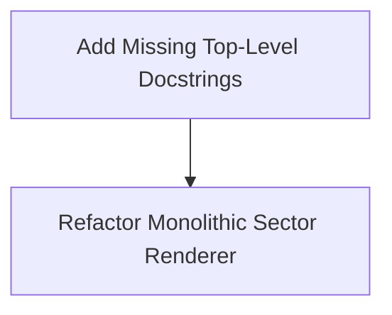

# Wormhole Control — Comprehensive Analysis Report

## Executive Summary

A thorough analysis of the **Wormhole Control** codebase and documentation was conducted. The project is a feature-rich, turn-based 4X space strategy prototype built with Python, `pygame-ce`, and `pygame_gui`. It features a multi-scale universe (Galaxy, System, Sector views), modular ship design with dynamic component sizing, a custom unit designer, turn-based combat, resources (Credits, Metal, Crystal, Antimatter), fog of war, and an automated order system.

While the codebase exhibits strong architectural foundations—such as decoupled event buses, component-based entity systems, and flexible order structures—there are several **monolithic source files, logic duplication, comment omissions, and refactoring opportunities** that require attention to elevate code quality, maintainability, and test reliability.

---

## 1. Bugs, Test Suite Failures & Logical Flaws

During test suite execution (`py -m pytest`), **all 444 out of 444 tests passed** cleanly with no module-level import side effects or setup failures.

---

## 2. Code Quality, Organization & Cruft Audit

### 2.1 Monolithic Source Files
Several files have grown excessively large, combining rendering, state handling, and UI layout into monolithic scripts:
1. [sector_renderer.py](file:///d:/Programming/Github_repos/Wormhole-Control/rendering/sector_renderer.py) (~92 KB, ~2,200 lines): Combines background rendering, celestial body rendering, particle system rendering (storms/nebulae), selection bracket drawing, range circle overlays, and order line visualization.
2. [unit_editor_gui.py](file:///d:/Programming/Github_repos/Wormhole-Control/unit_editor_gui.py) (~81 KB, ~1,880 lines): Contains layout creation, state sync, widget creation, dynamic cost recalculation, and template serialization in a single class.
3. [game.py](file:///d:/Programming/Github_repos/Wormhole-Control/game.py) (~87 KB, ~1,600 lines): Functions as central controller, view state machine, event listener, and UI sidebar content generator.
4. [gui.py](file:///d:/Programming/Github_repos/Wormhole-Control/gui.py) (~77 KB, ~1,800 lines): Combines top bar, sidebar, context menu, and build menu elements.

### 2.2 Logic Duplication
- **Coordinate Conversion Clamping**: Sector-to-pixel coordinate conversion and bounding calculations are duplicated between `sector_utils.py`, `geometry.py`, and `input_processor.py`.

---

## 3. Comments & Docstrings Audit

### 3.1 Comment Density & Over-Restatement
- High-level module headers and block comments are generally informative.
- However, line-by-line comments occasionally restate standard Python operations without providing context.
  - *Example*: `# Add component to dict`, `# Loop through list of units`, `# Set variable to True`.
  - *Recommendation*: Remove redundant line comments; retain comments that document mathematical formulas, game rules, or non-obvious design choices.

### 3.2 Missing Function Docstrings
While major classes have docstrings, several internal helper functions and event handlers lack top-level docstrings outlining their purpose, arguments, and return types.
- **`game.py`**: Helper methods like `_handle_left_click`, `_handle_right_click`, `update_side_bar_content`, and camera smoothing handlers lack standard Google/Sphinx style docstrings.
- **`unit_editor_gui.py`**: Internal UI builder methods (`_build_col1_config`, `_build_col2_components`, `_sync_widgets_from_template`) lack explicit argument and return value documentation.

---

## 4. Element Naming Analysis

1. **`in_hex` Attribute Name**:
   - On `GameObject`, the hex position is named `in_hex`. In some modules it is referred to as `hex_coord` or `sector_hex`. Standardizing on `hex_coord` would improve clarity.
2. **`hangar_component` vs `strikecraft_bay_component`**:
   - `HangarComponent` stores regular units (e.g. ships, constructors).
   - `StrikecraftBayComponent` stores strikecraft wings (fighters, bombers).
   - In code and UI, terms like "Hangar", "Bay", and "Docked Units" are occasionally used interchangeably. Using distinct terms such as `ShipHangarComponent` vs `FighterBayComponent` would clarify usage.

---

## 5. Brainstorming Ideas for Improvement

### 5.1 Architecture & Modularization
1. **Split Heavy Renderers**:
   - Decompose `sector_renderer.py` into dedicated sub-renderers:
     - `SectorGridRenderer` (hex grid & background stars)
     - `SectorCelestialRenderer` (planets, stars, nebulae, storms)
     - `SectorEntityRenderer` (ships, stations, minefields)
     - `SectorOverlayRenderer` (selection brackets, order path lines, sensor range circles)

### 5.2 Performance Optimizations
1. **Spatial Hash / Quadtree for Sector View**:
   - Currently, click detection, range checks, and sensor visibility scans iterate through all units in a system. Implementing spatial hashing for sector objects will optimize performance when dealing with hundreds of units.
2. **Background Star & Grid Caching**:
   - Pre-render static sector background elements (grid lines, distant starfields) onto a cached `pygame.Surface` and blit directly during camera movement, avoiding per-frame re-computation.

### 5.3 Gameplay & AI Features
1. **AI Unit Design Integration**:
   - Enable AI players to utilize the `CustomTemplateManager` to create specialized ship variants (e.g. anti-strikecraft escorts, heavy siege platforms) based on available tech and enemy fleet composition.
2. **Enhanced Marine Boarding Action**:
   - Expand `MarinesComponent` to support planetary raiding or space station defense/capture mechanics.

---

## 6. Recommended Action Plan

1. **Docstrings & Code Quality**:
   - Standardize top-level docstrings for internal methods across `game.py`, `gui.py`, and `unit_editor_gui.py`.
2. **Refactoring & Polish**:
   - Modularize `sector_renderer.py` into dedicated sub-renderers.

